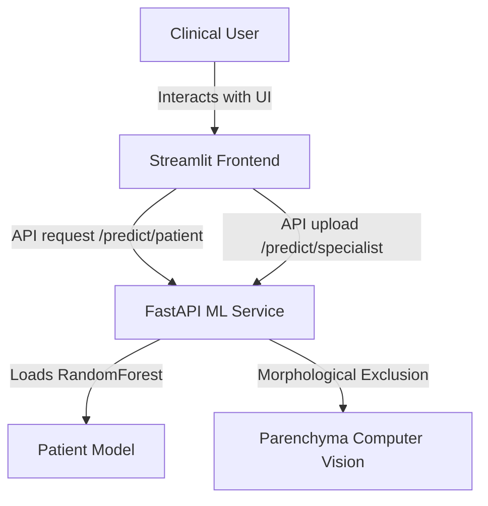

# 🧠 Clinical Assistant & ML Microservice

This project is a multi-container machine learning application designed to assist in cerebral stroke diagnosis. It features a high-fidelity conversational Streamlit frontend (the **AVC Agent**) and a robust FastAPI backend microservice.

---

## 🏗️ Architecture



### 1. **Streamlit Frontend Chat Console** (Runs on port `8501`)
A premium clinical chat interface that handles interaction as a discussion between the clinician and the **AVC Agent**:
- **Structured Inputs**: Sidebar-based forms for inputting tabular clinical parameters and uploading CT scan images.
- **Visual Reports**: Beautiful, color-coded HTML report cards displaying stroke probabilities, classifications, and tailored clinical guidance directly in the chat.
- **Conversational Queries**: Interactive text replies to clinical questions about stroke warning signs, ischemic vs. hemorrhagic strokes, and model details.

### 2. **FastAPI ML Microservice** (Runs on port `8000`)
Exposes REST endpoints for model inference and health checking:
- **`POST /predict/patient`**: Receives 10 raw features (age, BMI, glucose, hypertension, heart disease, smoking, etc.), scales inputs, runs a pre-trained **Random Forest Classifier**, and recalibrates the output probability to clinically relevant ranges. Falls back to a rule-based engine if models are missing.
- **`POST /predict/specialist`**: Accepts an uploaded brain CT-scan slice. Uses center cropping and Morphological Erosion to exclude skull bone structures and background, then performs statistical analysis on the brain parenchyma (mean density, left-right asymmetry, bright blood/dark flow restriction indicators) to output stroke classifications (`NORMAL`, `ISCHEMIC_STROKE`, `HEMORRHAGIC_STROKE`).
- **`GET /`**: Health status check and listing of loaded model metadata.

---

## 📂 Project Structure

```
AVC-agent/
├── avc-ml-service/             # FastAPI Backend Microservice
│   ├── Dockerfile              # Docker instructions (Python 3.11-slim)
│   ├── requirements.txt        # Backend dependencies (Tensorflow omitted for CPU speed)
│   ├── app.py                  # App initialization & CORS setup
│   ├── routes/                 # FastAPI routes (patient & specialist predict)
│   ├── schemas/                # Pydantic request/response structures
│   └── models/                 # Model artifacts (.pkl)
│       └── model for patient/  # Raw training notebook & dataset
├── frontend/                   # Streamlit Dashboard UI
│   ├── Dockerfile              # Docker instructions (Python 3.11-slim)
│   ├── requirements.txt        # Streamlit & Requests
│   └── app.py                  # Chat UI & stylesheet code
├── docker-compose.yml          # Container orchestrator
└── README.md                   # Project documentation (this file)
```

---

## 🚀 How to Run

Deploy the entire stack with a single command:

```bash
docker compose up -d --build
```

This will automatically:
1. Copy model files into position.
2. Build the FastAPI service (`avc-api` on internal port `8000`, exposed to host on `8000`).
3. Build the Streamlit dashboard (`frontend` on port `8501`, exposed to host on `8501`).
4. Establish dependencies so that the frontend starts only after the API container is verified healthy.

### Accessing the Applications
* **Frontend Web Console**: Open [http://localhost:8501](http://localhost:8501) in your browser.
* **API Interactive Swagger Documentation**: Open [http://localhost:8000/docs](http://localhost:8000/docs) in your browser.
* **API Health Check Endpoint**: Open [http://localhost:8000/](http://localhost:8000/) in your browser.

---

## 🛠️ Developer Customizations

* **Fast Build System**: `requirements.txt` has been optimized to exclude heavy GPU dependencies like `tensorflow` (which was only used in the training notebooks), saving over **1.5 GB** in container storage and accelerating builds by 10x.
* **Network & Cross-Origin Settings**: Configured internal Docker DNS (`http://avc-api:8000`) for service-to-service requests, with custom CORS headers enabled inside `app.py` to allow cross-origin requests from web clients.
* **Decision Support Warning**: All diagnostic classifications are for decision-support only. Always refer to emergency services in acute stroke situations.
